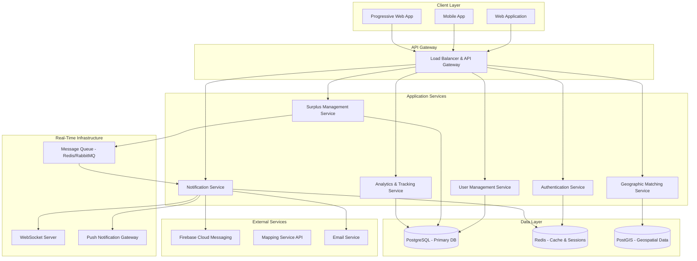

# Design Document: HungerLink

## Overview

HungerLink is a real-time food surplus coordination platform that connects institutional food providers (college canteens, messes) with food recipients (NGOs, community organizations) to minimize food waste. The system prioritizes speed and reliability to ensure surplus food is collected within safe time windows before it becomes unusable.

The platform operates on a publish-subscribe model where food providers broadcast surplus availability, and nearby recipients receive immediate notifications to coordinate rapid pickup. Geographic proximity matching ensures logistical feasibility while time-critical operations maintain food safety standards.

## Architecture

### High-Level Architecture



### Service Architecture Pattern

The system follows a microservices architecture with event-driven communication:

- **API Gateway**: Single entry point handling authentication, rate limiting, and request routing
- **Service Mesh**: Independent services communicating via message queues and REST APIs
- **Event-Driven**: Surplus creation triggers cascading notifications through pub-sub messaging
- **Real-Time Layer**: WebSocket connections and push notifications for immediate updates

## Components and Interfaces

### Core Services

#### Authentication Service
- **Purpose**: User registration, login, role-based access control
- **Key Functions**:
  - JWT token generation and validation
  - Role assignment (Food_Provider, Food_Recipient, Admin)
  - Session management with Redis caching
- **API Endpoints**:
  - `POST /auth/register` - User registration with role selection
  - `POST /auth/login` - Authentication with credential validation
  - `POST /auth/refresh` - Token refresh mechanism
  - `GET /auth/profile` - User profile retrieval

#### User Management Service
- **Purpose**: Profile management, organization details, preferences
- **Key Functions**:
  - Organization profile creation and updates
  - Operating hours and capacity management
  - Geographic location storage and validation
- **API Endpoints**:
  - `GET /users/profile` - Retrieve user profile
  - `PUT /users/profile` - Update profile information
  - `GET /users/nearby` - Find nearby organizations

#### Surplus Management Service
- **Purpose**: Core surplus food reporting and lifecycle management
- **Key Functions**:
  - Surplus report creation with validation
  - Pickup request processing and allocation
  - Status tracking and updates
- **API Endpoints**:
  - `POST /surplus/reports` - Create new surplus report
  - `GET /surplus/reports` - List available surplus (filtered by location)
  - `PUT /surplus/reports/{id}` - Update surplus status
  - `POST /surplus/reports/{id}/claim` - Submit pickup request
  - `PUT /surplus/reports/{id}/complete` - Mark pickup as completed

#### Geographic Matching Service
- **Purpose**: Location-based matching and distance calculations
- **Key Functions**:
  - Haversine distance calculations for proximity matching
  - Geospatial queries using PostGIS extensions
  - Dynamic radius expansion for broader reach
- **API Endpoints**:
  - `POST /matching/nearby` - Find recipients within radius
  - `GET /matching/distance` - Calculate distance between points
  - `POST /matching/optimize` - Optimize pickup routes

#### Notification Service
- **Purpose**: Multi-channel real-time notification delivery
- **Key Functions**:
  - WebSocket message broadcasting
  - Push notification delivery via FCM
  - Email notifications for critical updates
  - Notification queuing and retry logic
- **API Endpoints**:
  - `POST /notifications/send` - Send immediate notification
  - `GET /notifications/history` - Notification history
  - `PUT /notifications/preferences` - Update notification settings

### Real-Time Communication

#### WebSocket Implementation
```javascript
// WebSocket connection management
const wsConnection = {
  connect: (userId, userRole) => {
    // Establish authenticated WebSocket connection
    // Subscribe to relevant channels based on location and role
  },
  
  handleSurplusCreated: (surplusData) => {
    // Broadcast to nearby recipients
    // Include urgency level based on pickup window
  },
  
  handlePickupClaimed: (claimData) => {
    // Notify provider and update other recipients
  }
}
```

#### Push Notification Strategy
- **Firebase Cloud Messaging (FCM)** for cross-platform push notifications
- **Service Worker** registration for web push notifications
- **Token Management** with automatic refresh and device registration
- **Notification Prioritization** based on proximity and urgency

## Data Models

### User Entity
```sql
CREATE TABLE users (
    id UUID PRIMARY KEY DEFAULT gen_random_uuid(),
    email VARCHAR(255) UNIQUE NOT NULL,
    password_hash VARCHAR(255) NOT NULL,
    role user_role NOT NULL, -- 'food_provider' | 'food_recipient' | 'admin'
    organization_name VARCHAR(255) NOT NULL,
    contact_phone VARCHAR(20),
    location GEOGRAPHY(POINT, 4326) NOT NULL, -- PostGIS geography type
    address TEXT NOT NULL,
    operating_hours JSONB, -- Flexible schedule storage
    capacity_info JSONB, -- Recipient capacity details
    reliability_score DECIMAL(3,2) DEFAULT 5.00,
    created_at TIMESTAMP WITH TIME ZONE DEFAULT NOW(),
    updated_at TIMESTAMP WITH TIME ZONE DEFAULT NOW()
);

CREATE INDEX idx_users_location ON users USING GIST (location);
CREATE INDEX idx_users_role ON users (role);
```

### Surplus Report Entity
```sql
CREATE TABLE surplus_reports (
    id UUID PRIMARY KEY DEFAULT gen_random_uuid(),
    provider_id UUID NOT NULL REFERENCES users(id),
    food_type VARCHAR(100) NOT NULL,
    description TEXT,
    estimated_quantity VARCHAR(100) NOT NULL,
    pickup_location GEOGRAPHY(POINT, 4326) NOT NULL,
    pickup_address TEXT NOT NULL,
    available_from TIMESTAMP WITH TIME ZONE NOT NULL,
    available_until TIMESTAMP WITH TIME ZONE NOT NULL,
    status surplus_status DEFAULT 'available', -- 'available' | 'claimed' | 'completed' | 'expired' | 'cancelled'
    special_instructions TEXT,
    created_at TIMESTAMP WITH TIME ZONE DEFAULT NOW(),
    updated_at TIMESTAMP WITH TIME ZONE DEFAULT NOW()
);

CREATE INDEX idx_surplus_location ON surplus_reports USING GIST (pickup_location);
CREATE INDEX idx_surplus_status ON surplus_reports (status);
CREATE INDEX idx_surplus_available_until ON surplus_reports (available_until);
```

### Pickup Request Entity
```sql
CREATE TABLE pickup_requests (
    id UUID PRIMARY KEY DEFAULT gen_random_uuid(),
    surplus_report_id UUID NOT NULL REFERENCES surplus_reports(id),
    recipient_id UUID NOT NULL REFERENCES users(id),
    status pickup_status DEFAULT 'pending', -- 'pending' | 'accepted' | 'completed' | 'cancelled'
    estimated_pickup_time TIMESTAMP WITH TIME ZONE,
    actual_pickup_time TIMESTAMP WITH TIME ZONE,
    actual_quantity_collected VARCHAR(100),
    notes TEXT,
    created_at TIMESTAMP WITH TIME ZONE DEFAULT NOW(),
    updated_at TIMESTAMP WITH TIME ZONE DEFAULT NOW()
);

CREATE INDEX idx_pickup_surplus_id ON pickup_requests (surplus_report_id);
CREATE INDEX idx_pickup_recipient_id ON pickup_requests (recipient_id);
```

### Notification Log Entity
```sql
CREATE TABLE notification_logs (
    id UUID PRIMARY KEY DEFAULT gen_random_uuid(),
    user_id UUID NOT NULL REFERENCES users(id),
    surplus_report_id UUID REFERENCES surplus_reports(id),
    notification_type VARCHAR(50) NOT NULL, -- 'surplus_available' | 'pickup_claimed' | 'pickup_completed' | 'urgent_reminder'
    channel VARCHAR(20) NOT NULL, -- 'websocket' | 'push' | 'email'
    status VARCHAR(20) DEFAULT 'sent', -- 'sent' | 'delivered' | 'failed'
    content JSONB NOT NULL,
    sent_at TIMESTAMP WITH TIME ZONE DEFAULT NOW()
);

CREATE INDEX idx_notifications_user_id ON notification_logs (user_id);
CREATE INDEX idx_notifications_surplus_id ON notification_logs (surplus_report_id);
```

## Correctness Properties

*A property is a characteristic or behavior that should hold true across all valid executions of a system-essentially, a formal statement about what the system should do. Properties serve as the bridge between human-readable specifications and machine-verifiable correctness guarantees.*

Based on the requirements analysis, the following properties ensure system correctness:

### Property 1: Surplus Report Creation and Validation
*For any* surplus report submission, the system should create the report with proper metadata (timestamp, unique ID) if and only if all required fields (food type, quantity, location, pickup window) are provided and valid.
**Validates: Requirements 1.1, 1.2, 1.3, 1.4**

### Property 2: Surplus Report Lifecycle Management
*For any* surplus report, providers should be able to update or cancel the report at any time before pickup completion, and such changes should be reflected immediately in the system.
**Validates: Requirements 1.5**

### Property 3: Geographic Notification Distribution
*For any* newly created surplus report, all food recipients within the configured radius should receive real-time notifications containing complete food details (type, quantity, location, deadline).
**Validates: Requirements 2.1, 2.2, 4.3**

### Property 4: Notification Queuing and Delivery
*For any* offline food recipient, notifications should be queued and delivered when they reconnect, maintaining the original notification content and priority order.
**Validates: Requirements 2.3, 2.4**

### Property 5: Status Change Notification Cascade
*For any* surplus report status change (cancelled, fulfilled, claimed), all relevant food recipients should receive update notifications reflecting the new status.
**Validates: Requirements 2.5, 3.4**

### Property 6: Pickup Request Processing
*For any* available surplus report, food recipients should be able to submit pickup requests, and the system should process them on a first-come-first-served basis.
**Validates: Requirements 3.1, 3.2**

### Property 7: Pickup Confirmation Flow
*For any* accepted pickup request, both the food provider and recipient should receive confirmation notifications, and both parties should be able to mark the pickup as completed.
**Validates: Requirements 3.3, 3.5**

### Property 8: Distance Calculation and Radius Expansion
*For any* surplus report creation, the system should calculate distances to all registered recipients and expand the notification radius incrementally if no nearby recipients are found.
**Validates: Requirements 4.2, 4.4**

### Property 9: Location Handling Flexibility
*For any* user registration or location update, the system should accept either GPS coordinates or manual address entry and use them consistently for distance calculations.
**Validates: Requirements 4.1, 4.5**

### Property 10: Role-Based Registration Requirements
*For any* user registration, the system should require role-specific fields (institution details for providers, capacity info for recipients) based on the selected role.
**Validates: Requirements 5.1, 5.2, 5.3**

### Property 11: Authentication and Authorization
*For any* user authentication, the system should verify credentials and grant access only to features appropriate for the user's role.
**Validates: Requirements 5.4, 5.5**

### Property 12: Comprehensive Audit Logging
*For any* surplus report creation or pickup completion, the system should log all relevant details with timestamps for accountability and metrics calculation.
**Validates: Requirements 6.1, 6.2**

### Property 13: Analytics and Reliability Tracking
*For any* system data, administrators should be able to generate reports showing waste reduction metrics, pickup success rates, and user reliability scores.
**Validates: Requirements 6.3, 6.4, 6.5**

### Property 14: Mobile Push Notification Delivery
*For any* notification sent to mobile users, the system should deliver push notifications successfully and handle offline scenarios with proper queuing.
**Validates: Requirements 7.2, 7.5**

### Property 15: GPS Integration and Offline Caching
*For any* mobile device with GPS capability, the system should use device location for automatic distance calculations and cache essential data for offline access.
**Validates: Requirements 7.4, 7.5**

### Property 16: Food Safety Time Window Enforcement
*For any* surplus report, the system should enforce pickup windows that comply with food safety guidelines (maximum 2-4 hours depending on food type) and automatically mark expired reports as unavailable.
**Validates: Requirements 8.1, 8.3**

### Property 17: Time-Critical Escalation
*For any* surplus report approaching expiration or receiving no pickup requests, the system should send urgent notifications and escalate to broader geographic areas as needed.
**Validates: Requirements 8.2, 8.4**

## Error Handling

### Input Validation Errors
- **Invalid Location Data**: Return specific error messages for malformed coordinates or addresses
- **Missing Required Fields**: Provide field-specific validation errors for incomplete surplus reports
- **Invalid Time Windows**: Reject pickup windows that violate food safety guidelines with explanatory messages

### System Availability Errors
- **Database Connection Failures**: Implement circuit breaker pattern with graceful degradation
- **Notification Service Outages**: Queue notifications for retry with exponential backoff
- **Geographic Service Failures**: Fall back to cached distance calculations or manual address entry

### Business Logic Errors
- **Duplicate Pickup Claims**: Handle race conditions with database-level constraints and user-friendly error messages
- **Expired Surplus Access**: Prevent actions on expired surplus with clear status indicators
- **Unauthorized Access**: Return appropriate HTTP status codes with minimal information disclosure

### Real-Time Communication Errors
- **WebSocket Connection Drops**: Implement automatic reconnection with exponential backoff
- **Push Notification Failures**: Log failures and attempt alternative notification channels
- **Message Queue Overload**: Implement backpressure handling and priority-based processing

## Testing Strategy

### Dual Testing Approach

The system will employ both unit testing and property-based testing to ensure comprehensive coverage:

**Unit Tests** focus on:
- Specific examples of surplus report creation and validation
- Edge cases like expired pickup windows and invalid coordinates
- Integration points between services (authentication, notifications, database)
- Error conditions and exception handling scenarios

**Property-Based Tests** focus on:
- Universal properties that hold across all valid inputs
- Comprehensive input coverage through randomized test data generation
- Correctness properties defined in this design document

### Property-Based Testing Configuration

- **Testing Framework**: QuickCheck-style property testing library appropriate for the chosen implementation language
- **Test Iterations**: Minimum 100 iterations per property test to ensure statistical confidence
- **Test Tagging**: Each property test tagged with format: **Feature: hunger-link, Property {number}: {property_text}**
- **Requirements Traceability**: Each test explicitly references the design document property it validates

### Testing Categories

**Core Functionality Tests**:
- Surplus report lifecycle (creation, updates, expiration)
- Pickup request processing and allocation
- Real-time notification delivery and queuing
- Geographic matching and distance calculations

**Integration Tests**:
- End-to-end surplus-to-pickup workflows
- Multi-user scenarios with concurrent requests
- Cross-service communication (notifications, authentication, data persistence)
- Mobile app integration with push notifications

**Performance Tests**:
- Notification delivery latency under load
- Geographic query performance with large datasets
- WebSocket connection handling at scale
- Database query optimization validation

**Security Tests**:
- Authentication and authorization enforcement
- Input validation and sanitization
- Rate limiting and abuse prevention
- Data privacy and access control

The testing strategy ensures that both specific examples work correctly (unit tests) and universal system properties hold across all possible inputs (property tests), providing comprehensive validation of system correctness and reliability.